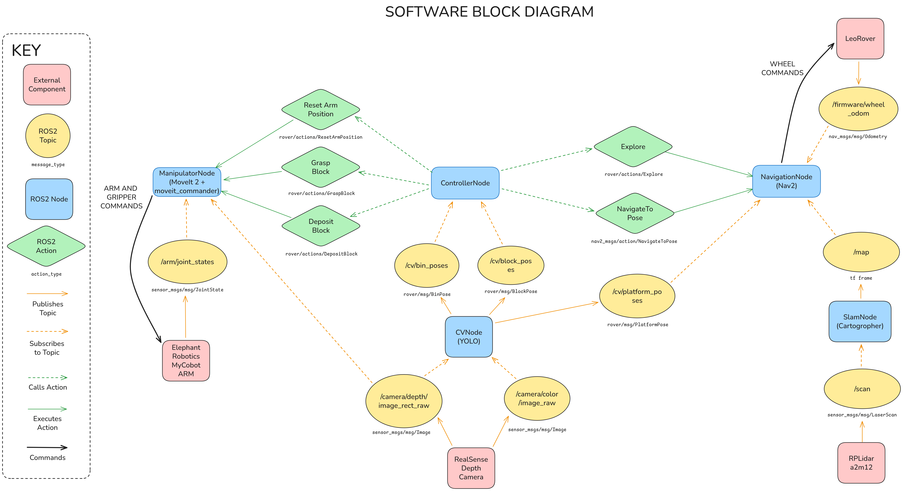

# RSDPTeam10
AERO62520 Robotic Systems Design Project Team 10

## Introduction
This repository contains ROS2 code used in the RSDP Leo Rover project. This code is organised into ROS2 packages and nodes which execute separate logic. Most code currently lives in branches as teammates work on individual task solving. This will be merged into `main` as packages are completed and integrated.

## Contributing
This repo follows standard software development best practice. All commits should be made on branches, and merged into `main` via pull requests. For more details on using Git, see the internal team [Guide to Git](https://livemanchesterac-my.sharepoint.com/:w:/g/personal/alexander_inch_postgrad_manchester_ac_uk/IQBNWKkrWXlWRrZvdg0988FWATn3JgwjHPRF73FxCxYHUuE?e=fSUf5N). The intention is that the `main` branch remains clean; this is where the code run on the main Rover will be contained, so it is paramount that it stays relatively clean.

## Repo Structure
A diagram indicating the planned software architecture is shown below. Each blue node below corresponds to a separate ROS2 package which will run during the robot's mission.



A quick explainer of the individual packages is given below. Contributors should update this list as they merge relevant pull requests introducting new packages:

- `rover_interface` Defines the messages and actions used by other packages.
- `rover_controller` Defines a finite state machine which tracks mission progress and executes the main plan.

## Running the Simulator
To run the sim, you need to export a shell variable so ROS knows where to find the models. You can also add the export to your `.bashrc` or `.zshrc` so you don't need to re-run it. I'm sure there's a better way to do this automatically, but I don't know how to do it.
```bash
> export GZ_SIM_RESOURCE_PATH=$GZ_SIM_RESOURCE_PATH:<path_to_the_repo>/RSDPTeam10/ros2_ws/src/rover_sim_gazebo/models
> export GZ_SIM_SYSTEM_PLUGIN_PATH=$GZ_SIM_SYSTEM_PLUGIN_PATH:/usr/lib/x86_64-linux-gnu/gz-sim-8/plugin
```

You can then run the simulator using 
```bash
> ros2 launch leo_gz_bringup leo_gz.launch.py sim_world:=pick_place_arena.sdf
```
